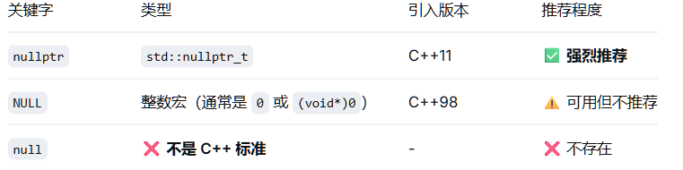
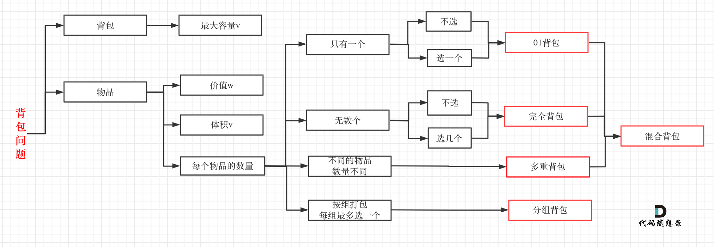
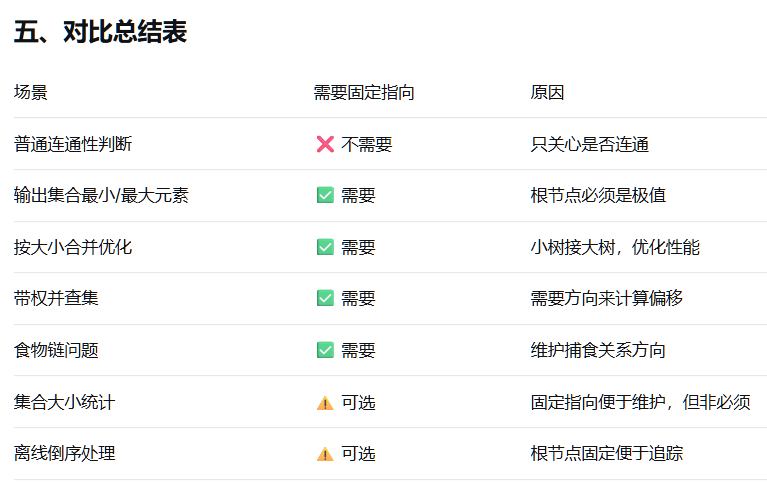

# 杂记
> 1. 加速IO
```cpp
cin.tie(nullptr);//解绑cin，cout
ios::sync_with_stdio(false);//关闭同步
```
> 2. while(cin>>n):
这里cin>>n的返回值是true/false，用于不确定读取，如果读取成功就返回true，失败(没有数据可读/读取类型不匹配)就false
> 单纯cin>>n的返回值是流对象本身

> 3. \b 
退格符，删除前一个字符

> 4. cin>>char不会接收空白符
cin>>str也不会接收空白符

> 5. 

> 6. sort默认升序
s.substr()只有一个参数表示从参数到结尾
string有insert(idx, a)...，能插入在特定位置(idx >= 0)

> 7. getline(cin, s)，读取整行，遇到\n停止并消费该\n
cin.ignore() 忽略一个字符，从cin -> getline()，要使用在cin后面忽略\n,防止getline得到空字符串
cin.ignore(x);//忽略x个字符
cin.ignore(x, char);//忽略x个字符，或者遇到char字符停止

> 8. floor(向下取整)配合eps。金额等有精度要求，
输出两位小数时，printf("%.2lf", floor((ans + eps) * 100) / 100);


> 9. 二分法l和r的初始化，应根据mid的含义，覆盖所有可能的有意义的值

> 10. bitset//长度为N的二进制串,最右边为最低位

[bitset当集合用，统计集合内元素个数](https://www.luogu.com.cn/problem/P10914#ide)
//
```cpp
#include<bitset>
bitset<N> bs;
bitset<8> b1;//00000000
bs.set(pos);//把下标为pos的位置设置为1,无参则全部1/ bs[pos] = 1;
bs.reset(pos);//设置为0，无参则全部0
bs.flip(pos);//同上取反
bs.count();//返回为1的位置的个数

```
# 算法
### 快速幂
1. 
```cpp
int qpow(int a, int b, int MOD){
    int res = 1;
    while(b){
        if(b & 1){
            res = res * a % MOD;
        }
        a = a * a % MOD;
        b >>= 1;
    }
    return res;
}
```
## 数学
##### 遍历线段上的整点
###### eg
1. [处理每条线段上的整点，>= 2的就是交点](https://www.luogu.com.cn/problem/P10907#ide)

###### code
```cpp
int x1, y1, x2, y2;//给定两整点，遍历线段
int dx = x2 - x1;
int dy = y2 - y1;
if(dx == 0 && dy == 0){//给的点重合
    //处理单点
}
int g = gcd(abs(dx), abs(dy));//线段上有g + 1个整点（包括给的点）
int stepx = dx / g;//步长
int stepy = dy / g;
for(int i = 0; i <= g; i++){//包括给定2点
    int x = x1 + i * stepx;//x1是dx被减数
    int y = y1 + i * stepy;
    //处理
}
```
## dp
#### eg
[选择不超过m个区间的最大值dp](https://www.luogu.com.cn/problem/P10911#ide)
```cpp
//没选a[i],已选j段 = 没选a[i - 1],选了j段 OR 选了a[i - 1],已选j段
dp[i][j][0] = max(dp[i - 1][j][0], dp[i - 1][j][1]);
// = 没选a[i - 1]且选了j - 1段（选a[i]且没选a[i - 1]，段数加1） OR 选了a[i - 1]且选了j段(选a[i]可连成一个区间) + v[i](选a[i])
dp[i][j][1] = max(dp[i - 1][j - 1][0], dp[i - 1][j][1]) + v[i];
```
[01双背包最大价值](https://www.luogu.com.cn/problem/P10987#ide)
```cpp
//尝试放a包或者b包，取最大值
for(int i = 0; i < n; i++){//遍历物品
        for(int j = a; j >= 0; j--){//a包
            for(int k = b; k >= 0; k--){//b包
                //条件放在内层，如果放for里，可能j<w[i]时，不进入for(k),导致不能放在a包时不放入b包
                if(j >= w[i])
                dp[j][k] = max(dp[j][k], dp[j - w[i]][k] + w[i]);
                if(k >= w[i])
                dp[j][k] = max(dp[j][k], dp[j][k - w[i]] + w[i]);
                //上面两个if本质上还是max(a, b, c);不会导致一个物品放在两个背包里
            }
        }
}
```
### 1.背包dp
##### 分类
##### 组合数/排列数
1. 组合数先便利物品后便利背包，物品从前到后选或者不选
2. 排列数先便利背包后便利物品
##### 01背包
1. 背包倒序（如果倒序，那么就得都初始化为0），保证物品最多使用一次。从小到大遍历背包，会导致大背包时或许已经选过当前物品了
2.  
```cpp
int value[n], weight[n];
int bag[num];
for(int i = 0; i < n; i++){
    for(int j = num - 1; j > weigth[i]; j--){
        dp[j] = max(dp[j - weight[i]] + value[i], dp[j]);
    }
}
```
##### 完全背包
1. 从小到大遍历背包， 能多选当前物品
2.  
```cpp
for(int i = 0; i < n; i++){
    for(int j = weight[i]; j < num; j++){
        dp[j] = max(dp[j - weight[i]] + value[i], dp[j]);
    }
}
```
## 质数筛法
##### 埃氏筛
1. 初始默认都是质数
素数的倍数不是素数
外层直到sqrt(N),内层到N
```cpp
vector<int> prime;
vector<bool> isprime(N,true);//初始默认都是质数
for(int i = 2; i * i <= N; i++){
    if(isprime[i]){//是素数，素数的倍数不是素数
        for(int j = i * i; j <= N; j += i){//从i * i开始
            isprime[j] = false;
        }
    }
}
for(int i = 2; i < N; i++){
    if(isprime[i]){
        prime.push_back(i);
    }
}
```
2. isprime可以用bitset，比vector<bool>更快
##### 线性筛
1. 每个合数只标记一次,比埃氏筛更快
N >= 1e8时
2. 
```cpp
vector<int> prime;
vector<bool> isprime(N, true);
for(int i = 2; i * i <= N; i++){
    if(isprime[i]){
        prime.push_back(i);
    }
    for(int pri : prime){
        if(i * pri > N) break;//超出筛范围
        isprime[i * pri] = false;//标记倍数不是素数
        if(i % pri == 0) break;/////////保证合数只被筛一次
    }
}
```
## 反转二进制
```cpp
//13(1101) -> 11(1011)
int reverseBit(int a){
    int res = 0;
    while(a){
        res = (res << 1) + (a & 1);
        a >>= 1;
    }
    return res;
}
``` 
## x转10进制
```cpp
//s是x进制下的数
ll xto10(string s, int x){
    ll res = 0;
    ll idx = 0;
    while(idx < s.size()){
        if(res > N) return -1;//判断溢出!!!!，看情况
        res = res * x + s[idx++] - '0';//十以内进制减’0‘，16进制减’A'/'a'
    }
    return res;
}
```


## 搜索
### (dfs)回溯
1. 回溯 = dfs + 状态重置
##### eg
1. [生成string全排列，找结果](https://www.luogu.com.cn/problem/P15435#ide)
##### Code
```cpp
void backtrack(参数列表){
    if(终止条件){
        //保存路径
        return;
    }
    //当前层遍历内容
    for(当前节点可选择内容){
        //保存选择
        backtrack(参数列表1);
        //回溯pop_back();
    }
}
```
### bfs
##### eg
1. [多源bfs相遇](https://www.luogu.com.cn/problem/P12270#ide)
2. [bfs找符合特定要求的倍数](http://47.121.118.174/p/523)
3. [旋转矩阵得到目标矩阵所需最小操作次数](https://www.luogu.com.cn/problem/P10578#ide)
```cpp
//反向操作，bfs预处理出所有可能的初始状态和最小步数
```
##### Code
```cpp
//网格类型遍历
void bfs(int x, int y, int n, int m){//n，m为边界
    queue<pair<int, int>> que;
    que.push({x, y});//添加起点
    used[x][y] = true;
    while(!que.empty()){
        int curx = que.front().first;//取队首元素
        int cury = que.front().second;
        que.pop();//出队（curx，cury）
        for(int i = 0; i < 方向数; i++){//遍历当前节点的可选择节点
            int nextx = curx + dir[i][0];
            int nexty = cury + dir[i][1];
            if(nextx >= 0 && nextx < n && nexty >= 0 && nexty < n && !used[nextx][nexty]){//合法判断
                que.push({nextx, nexty});//添加
                used[nextx][nexty] = true;
                //其他操作
            }
        }
    }
}
```
## 字符串
### 字符串哈希
##### Code
```cpp
//另一种ull，自然溢出
//单哈希：base > 字符集（下面为s[i]的可能种类数）
using ll = long long;//
const int base = 131;//看做把字符串变成base进制 131 13331等
const int mod = 1e9 + 7;//余数
ll tohash(string s){
    ll res = 0;
    for(int i = 0; i < s.size(); i++){
        res = (res * base % mod + (s[i] - 'a' + 1)) % mod;//小写字母映射到1 - 26上，+1为了避免0(加上映射能让哈希值更紧凑，理论上减小冲突)
    }
    return res;
}
```


# 数据结构
### 并查集
##### eg
[小明有多少个朋友](https://www.luogu.com.cn/problem/P2078)
```cpp
//维护小明所在集合
//用find(小明) == find(i)遍历找人(issame)
```
##### 注意
1. 处理输入数据时不是单纯pre[x] = y;, 而是使用join(int x, int y);
2. 处理输入时指向通常不重要，重要的是连通关系
3. 关于指向

##### Code
```cpp
vector<int> pre[N];
vector<int> rank[N];//
//初始化
void init(int n){
    for(int i = 0; i < n; i++){
        pre[i] = i;
    }
    return;
}
//查找
int find(int u){
    if(u == pre[u]){
        return u;
    }
    return find(pre[u]);
}
//while实现find()
int find(int u){
    while(u != pre[u]){
        u = pre[u];
    }
    return u;
}
//合并，处理输入数据时使用
void unite(int x, int y){//(join)
    pre[find(x)] = find(y);//y的根节点是x根节点的父亲
}
//检查是否是同一个集合
int issame(int x, y){
    return find(x) == find(y);
}

//优化:

//把u的父亲变为u所在集合的根节点，即减小了集合深度
int find(int u){
    if(u == pre[u]){
        return u;
    }
    return pre[u] = find(pre[u]);
}

void init(int n){
    for(int i = 0; i< n; i++){//需新设rank[N];
        pre[i] = i;
        rank[i] = 1;//每个节点的高度都初始为1       
    }
}
//合并过程尽可能减小树的深度
void unite(int x, int y){
    int fx = find(x);
    int fy = find(y);
    if(rank[fx] > rank[fy]){
        pre[fy] = fx;
    }
    else{
        if(rank[fx] == rank[fy]) rank[fy]++;//fy当根，别忘++
        pre[fx] = fy;
    }
}
```
### 单调栈
##### eg
[接雨水](https://leetcode.cn/problems/trapping-rain-water/)
##### 注意
> 栈中放下标

> 找右边就顺序遍历，栈中元素是后面的元素在前面元素的上面/找左边就倒序遍历，下标小的在栈口
##### Code
```cpp
//以找右边第一个大于当前值的值的下标之间的距离为例
//找大于就while处理> ,while中处理出结果
vector<int> v(n);//原数组
vector<int> ans;//结果数组
stack<int> st;//单调栈
for(int i = 0; i < n; i++){//
    while(!st.empty() && v[i] > st.top()){
        ans[st.top()] = i - st.top();
        st.pop();//记得处理完后推出栈
    }
    st.push(i);
}
return ans;
```

### 链表
##### 双向链表
###### eg
[特定位置删除，末尾添加，快速求前后项](https://www.luogu.com.cn/problem/P12288#ide)
###### Code
```cpp

//貌似可以用link改进下面的函数
void link(lst* a, lst* b){//使得a -> b
    a -> nex = b;
    b -> pre = a;
}//下面操作可以以link为元改写

typedef struct list{
    int val;
    struct list* pre;
    struct list* nex;
}lst;

lst* head;
//初始化
void init(){
    head = (lst*)malloc(sizeof(lst));
    head -> val = -1;
    head -> pre = head;
    head -> nex = head;//都指向自己
}

lst* add(int x){//认为head -> pre 就是尾节点
    lst* newnode = (lst*)malloc(sizeof(lst));//定义新节点
    newnode -> val = x;
    head -> pre -> nex = newnode;
    newnode -> pre = head -> pre;
    newnode -> nex = head;
    head -> pre = newnode;
    return newnode;//返回新添加的节点
}
//删除特定节点
void delet(lst* node){//a -> b -> c, node == b
    node -> pre -> nex = node -> nex;//a -> c
    node -> nex -> pre = node -> pre;//c -> a
    free(node);//释放node指向的空间
    node = nullptr;//此处是改变指针的值，不会在函数外起作用/可不写
}


```
### 树
##### 树的直径
1. 树的直径：树上两节点的最大距离
###### eg
1. [得到树的直径](https://www.luogu.com.cn/problem/P12873#ide)
###### Code
```cpp
//n个节点
int ans = 0;
vector<vector<int>> graph(n);//图
//f[x]表示 处理过的 从x节点向下走的最大距离
vector<int> f(n);
void dfs(int x, int fx){//x和它的父节点
    for(int v : graph[x]){
        if(v == fx) continue;//不重复遍历父节点
        dfs(v, x);
        //维护ans表示 处理过的 在x节点处拐弯的树的直径
        ans = max(ans, f[x] + f[v] + 1);
        //f[v] + 1表示 经过v点的 从x向下走的最大距离
        f[x] = max(f[x], f[v] + 1);//维护f[x] 
    }
    return;
}

dfs(1, 0);//起始节点可以任选，树是联通的/父节点用不存在的节点(1 - n ,选择0等)
```